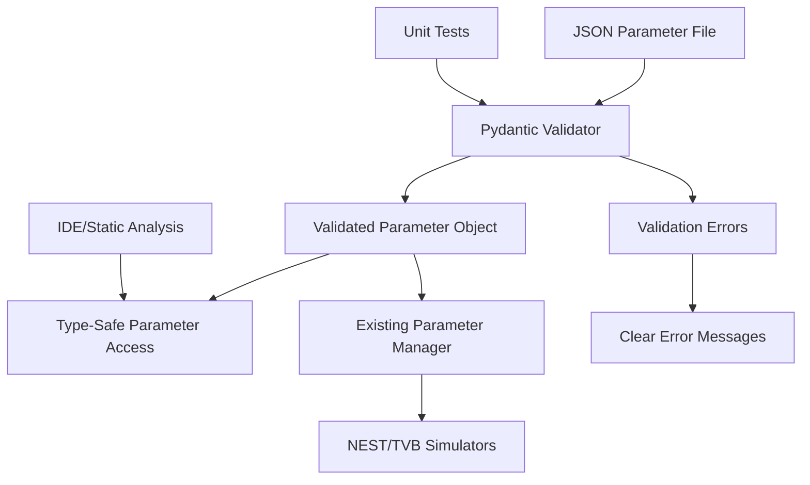

# Design Document

## Overview

This design document outlines the integration of Pydantic validation into the TVB-NEST co-simulation framework using a Test-Driven Development approach. The design prioritizes backward compatibility, type safety, and seamless integration with the existing MPI-based architecture.

## Architecture

### Current State Analysis

The existing parameter system has several components:

1. **JSON Parameter Files**: Hierarchical structure with 'param_' prefixed sections
2. **Manual Validation**: 25+ lines of manual checks in `run_exploration.py`
3. **Parameter Manager**: `parameters_manager.py` handles parameter linking and generation
4. **Cross-Dependencies**: Complex relationships between NEST and TVB parameters

### Target Architecture



## Components and Interfaces

### 1. Parameter Schema Definitions

**Location**: `nest_elephant_tvb/orchestrator/schemas.py`

```python
from pydantic import BaseModel, Field, validator, root_validator
from typing import List, Optional, Dict, Any
from pathlib import Path

class CoSimulationParams(BaseModel):
    """Co-simulation configuration parameters"""
    co_simulation: bool = Field(..., alias="co-simulation", description="Enable co-simulation")
    nb_MPI_nest: int = Field(..., ge=1, le=1000, description="Number of MPI processes for NEST")
    level_log: int = Field(..., ge=0, le=4, description="Logging level")
    cluster: bool = Field(default=False, description="Run on cluster")
    synchronization: Optional[float] = Field(None, gt=0.1, lt=1000.0)
    id_region_nest: Optional[List[int]] = Field(None, description="NEST region IDs")
    record_MPI: bool = Field(default=False)
    
    @validator('id_region_nest')
    def validate_region_ids(cls, v):
        if v is not None and len(v) == 0:
            raise ValueError("id_region_nest cannot be empty list")
        return v

class NestParams(BaseModel):
    """NEST simulation parameters"""
    sim_resolution: float = Field(..., gt=0.001, le=10.0)
    master_seed: int = Field(..., ge=1, le=2**31-1)
    total_num_virtual_procs: int = Field(..., ge=1, le=1000)
    overwrite_files: bool = Field(default=True)
    print_time: bool = Field(default=True)
    verbosity: int = Field(default=20, ge=0, le=100)

class SimulationParameters(BaseModel):
    """Complete simulation parameter set"""
    result_path: str = Field(..., description="Output directory path")
    begin: float = Field(..., ge=0.0, description="Simulation start time")
    end: float = Field(..., gt=0.0, description="Simulation end time")
    
    param_co_simulation: CoSimulationParams
    param_nest: Optional[NestParams] = None
    param_nest_topology: Optional[Dict[str, Any]] = None
    param_nest_connection: Optional[Dict[str, Any]] = None
    param_nest_background: Optional[Dict[str, Any]] = None
    
    # TVB parameters (initially as dicts for gradual migration)
    param_tvb_model: Optional[Dict[str, Any]] = None
    param_tvb_connection: Optional[Dict[str, Any]] = None
    param_tvb_coupling: Optional[Dict[str, Any]] = None
    param_tvb_integrator: Optional[Dict[str, Any]] = None
    param_tvb_monitor: Optional[Dict[str, Any]] = None
    
    # Translation parameters
    param_TR_nest_to_tvb: Optional[Dict[str, Any]] = None
    param_TR_tvb_to_nest: Optional[Dict[str, Any]] = None
    
    @validator('end')
    def end_must_be_after_begin(cls, v, values):
        if 'begin' in values and v <= values['begin']:
            raise ValueError('end time must be greater than begin time')
        return v
    
    @root_validator
    def validate_co_simulation_requirements(cls, values):
        co_sim = values.get('param_co_simulation')
        if co_sim and co_sim.co_simulation:
            required_sections = ['param_TR_nest_to_tvb', 'param_TR_tvb_to_nest']
            for section in required_sections:
                if not values.get(section):
                    raise ValueError(f"Co-simulation requires {section} section")
        return values
    
    @validator('result_path')
    def validate_result_path(cls, v):
        path = Path(v)
        try:
            path.parent.mkdir(parents=True, exist_ok=True)
        except (OSError, PermissionError) as e:
            raise ValueError(f"Cannot create result directory: {e}")
        return str(path.resolve())
    
    class Config:
        extra = "allow"  # Backward compatibility
        validate_assignment = True
        allow_population_by_field_name = True
```

### 2. Validation Service

**Location**: `nest_elephant_tvb/orchestrator/validation.py`

```python
from pathlib import Path
import json
from typing import Dict, Any, Union
from .schemas import SimulationParameters

class ParameterValidationError(Exception):
    """Custom exception for parameter validation failures"""
    pass

class ParameterValidator:
    """Service for parameter validation and loading"""
    
    @staticmethod
    def load_and_validate(parameters_file: Union[str, Path]) -> SimulationParameters:
        """Load and validate parameters from JSON file"""
        param_file = Path(parameters_file)
        
        if not param_file.exists():
            raise ParameterValidationError(f"Parameter file not found: {param_file}")
        
        try:
            with param_file.open('r', encoding='utf-8') as f:
                raw_data = json.load(f)
        except json.JSONDecodeError as e:
            raise ParameterValidationError(f"Invalid JSON: {e}")
        
        try:
            return SimulationParameters(**raw_data)
        except Exception as e:
            raise ParameterValidationError(f"Parameter validation failed: {e}")
    
    @staticmethod
    def validate_dict(raw_data: Dict[str, Any]) -> SimulationParameters:
        """Validate parameters from dictionary"""
        try:
            return SimulationParameters(**raw_data)
        except Exception as e:
            raise ParameterValidationError(f"Parameter validation failed: {e}")
```

### 3. Integration Layer

**Location**: `nest_elephant_tvb/orchestrator/parameter_integration.py`

```python
from typing import Dict, Any
from .validation import ParameterValidator, ParameterValidationError
from .schemas import SimulationParameters

class ParameterIntegration:
    """Integration layer between Pydantic validation and existing code"""
    
    @staticmethod
    def load_parameters_safe(parameters_file: str) -> Dict[str, Any]:
        """
        Load parameters with Pydantic validation, fallback to original method
        This allows gradual migration and testing
        """
        try:
            validated_params = ParameterValidator.load_and_validate(parameters_file)
            return validated_params.dict(by_alias=True)
        except ParameterValidationError as e:
            # Log validation error but don't break existing functionality
            import logging
            logger = logging.getLogger(__name__)
            logger.warning(f"Pydantic validation failed, using original method: {e}")
            
            # Fallback to original parameter loading
            return _load_parameters_original(parameters_file)
    
    @staticmethod
    def get_typed_parameters(parameters_file: str) -> SimulationParameters:
        """Get fully typed parameter object for new code"""
        return ParameterValidator.load_and_validate(parameters_file)

def _load_parameters_original(parameters_file: str) -> Dict[str, Any]:
    """Original parameter loading method for fallback"""
    # Implementation of current parameter loading logic
    pass
```

## Data Models

### Parameter Schema Hierarchy

```
SimulationParameters
├── result_path: str
├── begin: float
├── end: float
├── param_co_simulation: CoSimulationParams
│   ├── co_simulation: bool
│   ├── nb_MPI_nest: int (1-1000)
│   ├── level_log: int (0-4)
│   ├── cluster: bool = False
│   ├── synchronization: Optional[float] (0.1-1000.0)
│   ├── id_region_nest: Optional[List[int]]
│   └── record_MPI: bool = False
├── param_nest: Optional[NestParams]
│   ├── sim_resolution: float (0.001-10.0)
│   ├── master_seed: int (1-2^31-1)
│   ├── total_num_virtual_procs: int (1-1000)
│   ├── overwrite_files: bool = True
│   ├── print_time: bool = True
│   └── verbosity: int (0-100) = 20
└── param_*: Optional[Dict[str, Any]]  # Gradual migration
```

### Migration Strategy

1. **Phase 1**: Core parameters (co_simulation, nest basics)
2. **Phase 2**: NEST topology and connection parameters
3. **Phase 3**: TVB parameters
4. **Phase 4**: Translation parameters
5. **Phase 5**: Complete type safety

## Error Handling

### Validation Error Types

```python
class ValidationErrorTypes:
    MISSING_REQUIRED = "missing_required_parameter"
    INVALID_TYPE = "invalid_parameter_type"
    OUT_OF_RANGE = "parameter_out_of_range"
    CROSS_DEPENDENCY = "cross_parameter_dependency_failed"
    FILE_ACCESS = "parameter_file_access_error"
    JSON_PARSE = "json_parsing_error"
```

### Error Message Format

```python
{
    "error_type": "validation_failed",
    "parameter_file": "/path/to/parameter.json",
    "errors": [
        {
            "type": "invalid_type",
            "parameter": "param_co_simulation.nb_MPI_nest",
            "message": "Expected integer between 1 and 1000, got 'auto'",
            "current_value": "auto",
            "expected_type": "int",
            "valid_range": [1, 1000]
        }
    ],
    "suggestions": [
        "Set param_co_simulation.nb_MPI_nest to an integer value",
        "For automatic MPI process detection, use nb_MPI_nest: -1"
    ]
}
```

## Testing Strategy

### Test Structure

```
tests/
├── unit/
│   ├── test_parameter_schemas.py
│   ├── test_parameter_validation.py
│   └── test_parameter_integration.py
├── integration/
│   ├── test_existing_parameter_files.py
│   ├── test_backward_compatibility.py
│   └── test_mpi_parameter_sharing.py
└── fixtures/
    ├── valid_parameters/
    ├── invalid_parameters/
    └── edge_cases/
```

### Test Categories

1. **Schema Validation Tests**: Test individual parameter schemas
2. **Integration Tests**: Test with existing parameter files
3. **Backward Compatibility Tests**: Ensure existing functionality works
4. **Performance Tests**: Validate performance requirements
5. **Error Handling Tests**: Test error messages and recovery
6. **MPI Tests**: Test parameter sharing across processes

## Performance Considerations

### Optimization Strategies

1. **Lazy Validation**: Only validate accessed parameters
2. **Caching**: Cache validated parameters for reuse
3. **Minimal Overhead**: Use Pydantic's fast validation mode
4. **Memory Efficiency**: Avoid duplicate parameter storage

### Performance Targets

- Parameter validation: < 100ms
- Memory overhead: < 10MB
- Type checking: Zero runtime cost
- Error reporting: < 10ms

## Migration Path

### Phase 1: Foundation (Week 1)
- Create parameter schemas for core parameters
- Implement validation service
- Add integration layer with fallback

### Phase 2: Integration (Week 2)
- Integrate with `run_exploration.py`
- Add comprehensive tests
- Ensure backward compatibility

### Phase 3: Extension (Week 3)
- Extend schemas to cover more parameters
- Add custom validators for complex rules
- Performance optimization

### Phase 4: Adoption (Week 4)
- Remove fallback mechanisms
- Update documentation
- Train team on new system

This design ensures a smooth, test-driven integration of Pydantic validation while maintaining the robustness and compatibility of the existing TVB-NEST framework.